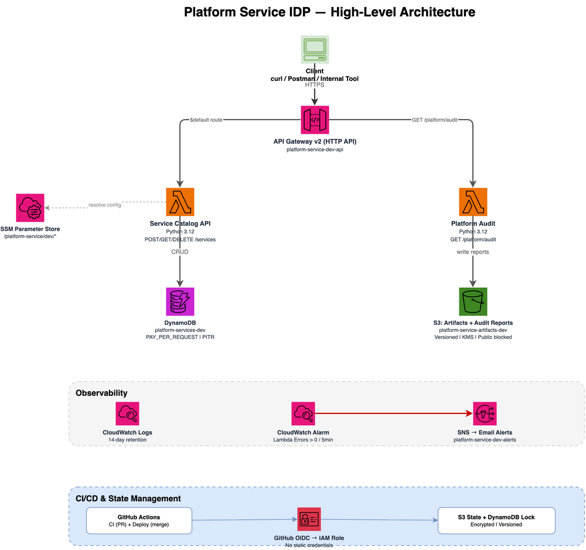
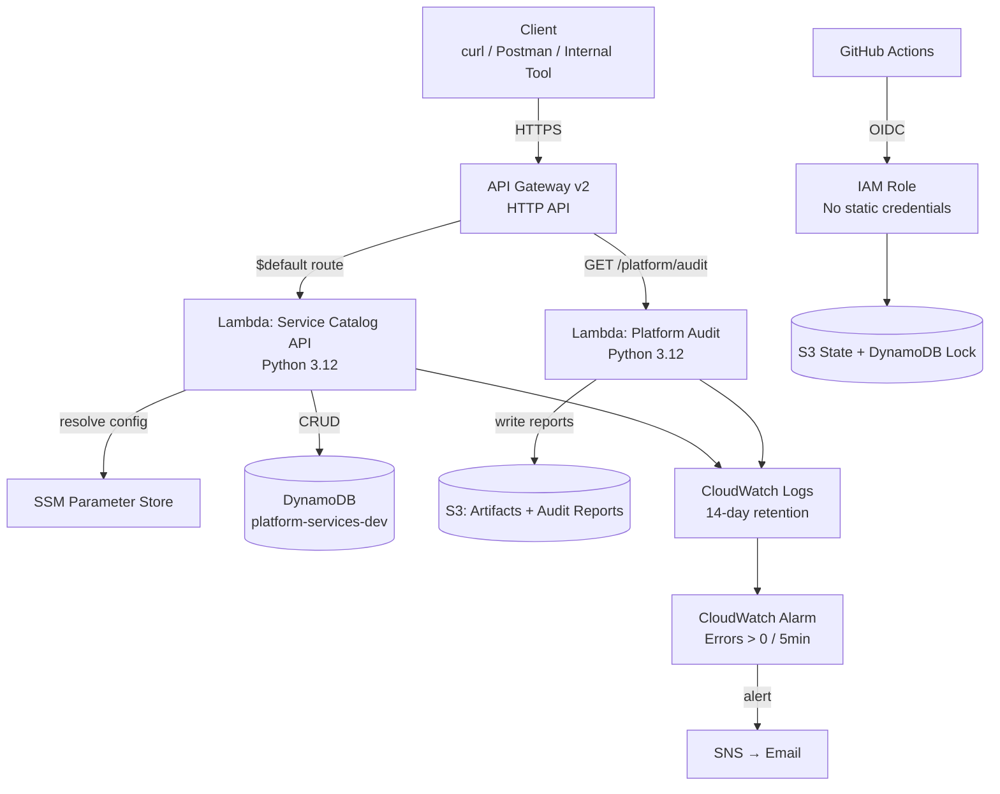

# Platform Service IDP

A self-service Internal Developer Platform (IDP) with two capabilities: a **Service Catalog API** for teams to register and manage service metadata, and a **Platform Audit** endpoint that aggregates operational intelligence across AWS resources. Built on serverless architecture — API Gateway v2, Lambda (Python 3.12), DynamoDB, S3 — all managed by Terraform with CI/CD via GitHub Actions.

## Architecture



> Raw draw.io files are in `diagrams/` — open with [app.diagrams.net](https://app.diagrams.net)



## What This Does

**Service Catalog API** — Internal teams register services (name, owner, description, runtime) via REST endpoints. Data persists in DynamoDB. This is the "developer portal backend" pattern from the assessment.

**Platform Audit** — A single `GET /platform/audit` call scans your AWS account and returns a JSON report covering S3 encryption status, DynamoDB backup configuration, Lambda function settings, and CloudWatch log retention. Reports are also written to S3 for historical tracking.

## Design Rationale

I chose Lambda over ECS because the service handles simple CRUD operations with no long-running processes — Lambda scales to zero, eliminates container management overhead, and reduces Terraform surface area. Cold start latency is acceptable for an internal API. The alternative was ECS Fargate, which would add a load balancer, task definitions, and capacity planning for no meaningful benefit at this scale.

DynamoDB was selected over RDS Aurora because the data model is a natural key-value fit (UUID primary key, simple attribute lookups). On-demand billing means zero capacity planning, no connection pooling, and no VPC configuration. If the service evolved to need relational queries or joins, RDS would be reconsidered — but for the current access patterns, DynamoDB is simpler and cheaper.

## Prerequisites

- Python 3.12+
- Terraform >= 1.5
- AWS CLI configured with SSO or IAM credentials
- GitHub repo with `AWS_ROLE_ARN` secret set (for CI/CD)

## Deploy

### 1. Bootstrap (first time only)

```bash
# Authenticate to AWS
aws sso login

# Deploy infrastructure
cd terraform
terraform init
terraform plan -var-file=tfvars-env/dev/dev.tfvars
terraform apply -var-file=tfvars-env/dev/dev.tfvars

# Package and upload Lambda code
./scripts/package-lambda.sh --upload platform-service-artifacts-dev lambda/package.zip

# Update Lambda functions with new code
aws lambda update-function-code --function-name platform-service-dev \
  --s3-bucket platform-service-artifacts-dev --s3-key lambda/package.zip --region us-east-2
aws lambda update-function-code --function-name platform-service-dev-audit \
  --s3-bucket platform-service-artifacts-dev --s3-key lambda/package.zip --region us-east-2
```

### 2. CI/CD (ongoing)

After bootstrap, all deployments go through GitHub Actions:

- **Pull Requests → main**: CI runs lint, tests, `terraform validate`, `terraform fmt`, `terraform plan`
- **Merge to main**: Deploy pipeline packages Lambda, uploads to S3, runs `terraform apply`

### 3. Local Development

```bash
cd app
pip install -r requirements.txt
PYTHONPATH=app python -m pytest app/tests/ -v
```

## API Reference

Base URL: your API Gateway endpoint from `terraform output api_endpoint`

### Service Catalog

| Method | Path | Description | Status |
|--------|------|-------------|--------|
| `POST` | `/services` | Register a new service | 201 |
| `GET` | `/services` | List all services | 200 |
| `GET` | `/services/{id}` | Get a service by ID | 200 / 404 |
| `DELETE` | `/services/{id}` | Delete a service | 204 |

**Create a service:**
```bash
curl -X POST "$API_URL/services" \
  -H "Content-Type: application/json" \
  -d '{"name": "auth-service", "owner": "platform-team", "description": "Auth service", "runtime": "python3.12"}'
```

### Platform Audit

| Method | Path | Description | Status |
|--------|------|-------------|--------|
| `GET` | `/platform/audit` | Run platform audit | 200 |

Returns a JSON report with `s3_buckets`, `dynamodb_tables`, `lambda_functions`, `cloudwatch_log_groups`, and a `summary` with `issues_found`. Also writes the report to `s3://platform-service-artifacts-dev/audit-reports/`.

## Terraform Modules

| Module | Purpose |
|--------|---------|
| `s3` | Artifacts bucket — versioned, KMS encrypted, public access blocked |
| `dynamodb` | Service catalog table — PAY_PER_REQUEST, PITR enabled |
| `iam` | Lambda execution role — DynamoDB + SSM read, no wildcards |
| `lambda_api` | Service Catalog Lambda + API Gateway v2 |
| `audit` | Audit Lambda + API Gateway route |
| `audit_iam` | Audit Lambda role — read-only AWS access + S3 write for reports |
| `observability` | CloudWatch Logs (14-day retention), Alarm (errors > 0), SNS topic |
| `notifications` | SNS email subscriptions (configurable list) |
| `github_oidc` | GitHub Actions OIDC provider + deploy IAM role |

## Repository Structure

```
├── app/
│   ├── src/
│   │   ├── handlers/          # Lambda entry points
│   │   ├── models/            # Data models
│   │   ├── services/          # DynamoDB service layer
│   │   └── utils/             # Logger, validator
│   ├── tests/                 # Unit + property tests
│   ├── Dockerfile
│   └── requirements.txt
├── terraform/
│   ├── main.tf                # Module composition + SSM parameters
│   ├── modules/               # 9 reusable modules
│   ├── tfvars-env/dev/        # Environment-specific variables
│   └── tests/                 # Terraform test (basic.tftest.hcl)
├── scripts/
│   └── package-lambda.sh      # Lambda packaging + S3 upload
├── .github/workflows/
│   ├── ci.yml                 # PR: lint + test + validate + plan
│   └── deploy.yml             # Merge: package + upload + apply
├── diagrams/                  # draw.io files + exported PNGs
├── .ai/                       # AI steering files and prompts
├── KIRO.md                    # AI agent configuration
└── README.md
```

## Observability

- **Structured JSON logging** — every log entry includes `timestamp`, `level`, `message`, `request_id`, `function_name`
- **CloudWatch Alarm** — fires when Lambda error count > 0 in a 5-minute window
- **SNS notifications** — alarm triggers email alerts to configured recipients
- **Log retention** — 14 days on all Lambda log groups

## Known Limitations

- **Authentication**: API is unauthenticated. API key or IAM auth planned for next iteration.
- **Pagination**: `GET /services` returns all records via DynamoDB Scan.
- **Environment**: Only `dev` is configured. Nonprod/prod tfvars directories exist but are empty.
- **Audit scope**: Read-only audit uses `*` resource for list/describe operations (DynamoDB, Lambda, CloudWatch). Scoped to the deploy account only.
